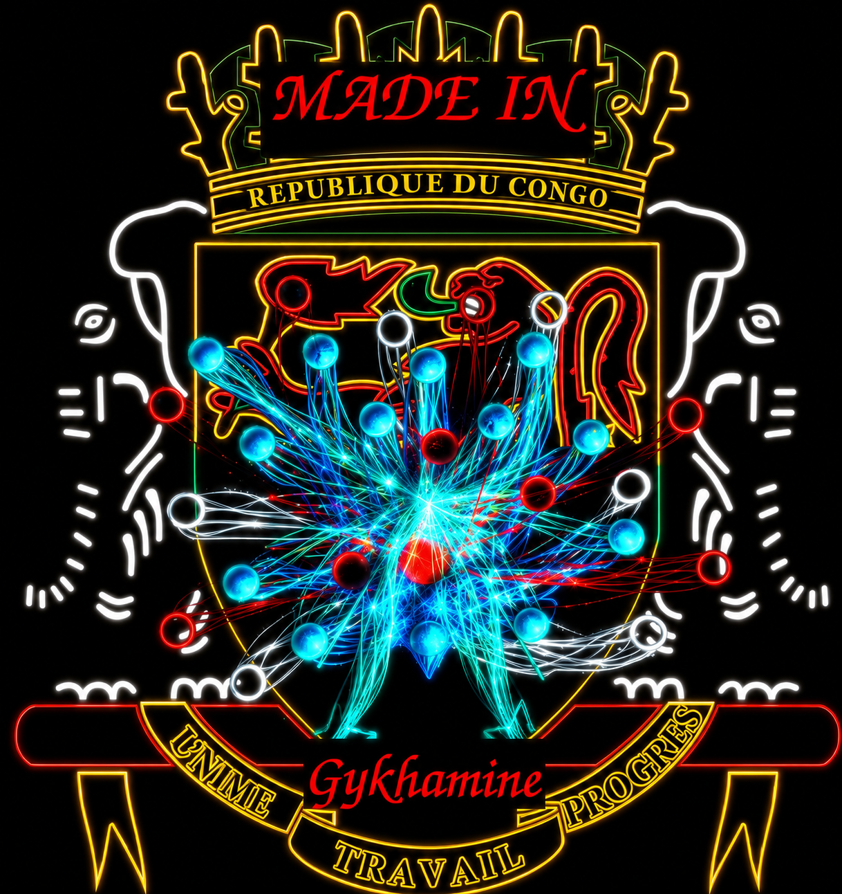

<h1 style="color: #ffffff; font-family: 'Cinzel', serif; letter-spacing: 4px; margin-bottom: 10px; text-shadow: 0 0 10px rgba(255,255,255,0.8);">GCI</h1>

  &gt; Partir de rien pour tout gagner_

  <a href="site/os/index.html" style="text-decoration: none; color: #00ffff; font-weight: bold; border: 1px solid #00ffff; padding: 10px 20px; border-radius: 4px; transition: all 0.3s; width: 250px; display: block; text-shadow: 0 0 5px #00ffff;" onmouseover="this.style.backgroundColor='#00ffff';this.style.color='#000000';" onmouseout="this.style.backgroundColor='transparent';this.style.color='#00ffff';">
    [ Gykhamine OS ]
  </a>

  <a href="site/index.html" style="text-decoration: none; color: #ffffff; border: 1px solid #333; padding: 10px 20px; border-radius: 4px; transition: all 0.3s; width: 250px; display: block;" onmouseover="this.style.borderColor='#ffffff';this.style.boxShadow='0 0 10px rgba(255,255,255,0.2)';" onmouseout="this.style.borderColor='#333';this.style.boxShadow='none';">
    Qui sommes-nous ?
  </a>

  <a href="site/formations/index.html" style="text-decoration: none; color: #ffffff; border: 1px solid #333; padding: 10px 20px; border-radius: 4px; transition: all 0.3s; width: 250px; display: block;" onmouseover="this.style.borderColor='#ffffff';this.style.boxShadow='0 0 10px rgba(255,255,255,0.2)';" onmouseout="this.style.borderColor='#333';this.style.boxShadow='none';">
    Formation
  </a>

  <a href="site/produits/index.html" style="text-decoration: none; color: #ffffff; border: 1px solid #333; padding: 10px 20px; border-radius: 4px; transition: all 0.3s; width: 250px; display: block;" onmouseover="this.style.borderColor='#ffffff';this.style.boxShadow='0 0 10px rgba(255,255,255,0.2)';" onmouseout="this.style.borderColor='#333';this.style.boxShadow='none';">
    Produits
  </a>

  <a href="site/blog/index.html" style="text-decoration: none; color: #ffffff; border: 1px solid #333; padding: 10px 20px; border-radius: 4px; transition: all 0.3s; width: 250px; display: block;" onmouseover="this.style.borderColor='#ffffff';this.style.boxShadow='0 0 10px rgba(255,255,255,0.2)';" onmouseout="this.style.borderColor='#333';this.style.boxShadow='none';">
    Blog
  </a>
  
  <a href="site/entreprise/index.html" style="text-decoration: none; color: #ffffff; border: 1px solid #333; padding: 10px 20px; border-radius: 4px; transition: all 0.3s; width: 250px; display: block;" onmouseover="this.style.borderColor='#ffffff';this.style.boxShadow='0 0 10px rgba(255,255,255,0.2)';" onmouseout="this.style.borderColor='#333';this.style.boxShadow='none';">
    Enterprise
  </a>

  <a href="site/gsc/index.html" style="text-decoration: none; color: #ffffff; border: 1px solid #333; padding: 10px 20px; border-radius: 4px; transition: all 0.3s; width: 250px; display: block;" onmouseover="this.style.borderColor='#ffffff';this.style.boxShadow='0 0 10px rgba(255,255,255,0.2)';" onmouseout="this.style.borderColor='#333';this.style.boxShadow='none';">
    Services
  </a>

